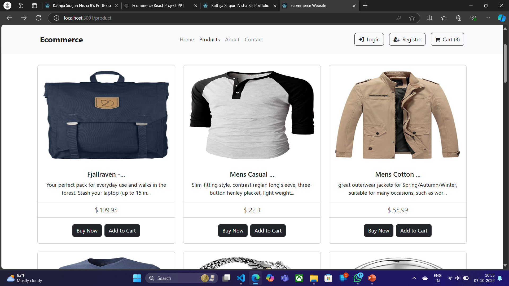

# E-Commerce Website

A Ecommerce Website made with React.js Framework.
<div align="center">
  
  
  
  
  [](https://twitter.com/intent/follow?screen_name=YourTwitterHandle)
  

  <br />
  <br />

  <h2 align="center">ReactJS Portfolio Website</h2>

  This is a fully responsive Ecommerce website, <br />Built using **ReactJS** and styled with **bootstrap**.

  <a href="https://Sirabi08.github.io/Ecommerce-React/"><strong>➥ Live Demo</strong></a>

</div>


## Features

- Easy to integrate with Backend
- Fully Responsive


## Screenshots

### Demo Screenshots





## Run Locally

Clone the project

```bash
git clone https://github.com/Sirabi08/Ecommerce-React.git

```

Go to the project directory

Install dependencies

```bash
  npm install
```

Start the server

```bash
  npm start
```


## Tech Stack

* [React](https://reactjs.org/)
* [Redux](https://redux.js.org/)
* [Bootstrap](https://getbootstrap.com/)
* [Fake Store API](https://fakestoreapi.com/)

## Contributing

Contributions are always welcome!
Just raise an issue, we will discuss it.


### Contact

If you want to contact with me you can reach me at [Twitter](https://www.twitter.com/siraj086).

